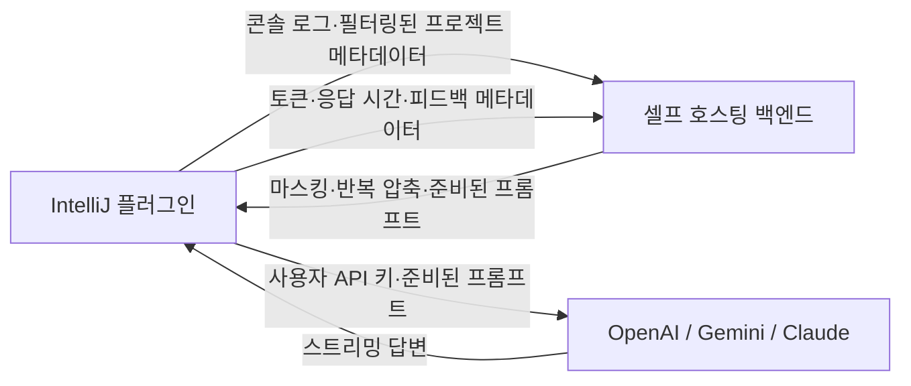

# AI Error Log Purifier

IntelliJ IDEA 콘솔 오류를 정제해 사용자가 선택한 LLM으로 분석하는 플러그인입니다. 별도로 실행되는 셀프 호스팅 Error Purifier 백엔드가 민감정보 마스킹, 반복 로그 압축, 프롬프트 준비를 담당하고, 플러그인은 사용자의 IDE에서 OpenAI, Google Gemini 또는 Anthropic 모델을 직접 호출합니다.

> GitHub README는 국내 포트폴리오 독자를 위해 한국어를 기본으로 합니다. JetBrains Marketplace 공개 설명, 심사 가이드, 개인정보 처리방침은 국제 배포 기준에 맞춰 영어로 제공합니다.

## 주요 기능

- Run/Debug 콘솔에서 선택한 로그 또는 전체 로그 분석
- 최대 1,000,000자의 콘솔 로그를 백엔드에서 마스킹·압축한 뒤 오류 중심 최대 12,000자로 정제
- 셀프 호스팅 백엔드를 통한 민감정보 마스킹과 반복 재시도·스택 트레이스 압축
- OpenAI, Google Gemini, Anthropic 모델의 스트리밍 응답 지원
- IntelliJ PasswordSafe 기반 LLM API 키 보관
- 빠른 분석, 정밀 분석, 심층 분석 모드
- AI 답변, 정제 로그, 실제 토큰 사용량, 응답 시간, 압축 절감량 확인
- 답변의 근거 로그 인용 누락과 IDE 종료 코드 오해석 가능성 경고
- 영어 기본 UI와 IntelliJ 한국어 로케일용 한국어 UI 제공

## 구성



- 백엔드는 플러그인에 포함되지 않으며 사용자가 별도로 실행합니다.
- LLM API 키와 실제 모델 호출은 사용자의 IDE에서 처리합니다.
- API 키는 Error Purifier 백엔드로 전송되지 않습니다.
- 일반 분석 흐름에서 AI 답변 본문은 백엔드로 전송하거나 저장하지 않습니다.

## 요구 사항

- IntelliJ IDEA 2026.2 이상(빌드 262 이상)
- 별도로 실행되는 [Error Purifier 백엔드](https://github.com/Seongbin-Choo/errorPurifier)
- OpenAI, Google Gemini 또는 Anthropic 중 사용할 제공자의 API 자격 증명
- 소스에서 플러그인을 빌드할 때만 JDK 25 필요

LLM 제공자 사용량은 사용자의 계정 정책에 따라 비용이 발생할 수 있습니다.

## 데이터 흐름

1. 콘솔에서 텍스트를 선택하면 선택 영역만 로그로 사용하고, 선택하지 않으면 전체 콘솔 내용을 사용합니다.
2. 최대 1,000,000자의 콘솔 로그, 지원되는 Gradle·Maven 빌드 파일에서 필터링한 메타데이터, Spring 설정 파일 존재 여부, 기본 플러그인 환경 태그를 사용자가 설정한 백엔드로 전송합니다. 더 큰 로그는 전송 전에 거부합니다.
3. 백엔드는 민감정보를 최선의 방식으로 마스킹하고 반복 로그를 압축한 뒤 오류 중심으로 최대 12,000자까지 줄여 준비된 프롬프트를 반환합니다.
4. 플러그인은 분석 모드 지시문을 추가하고 사용자가 선택한 LLM 제공자로 IDE에서 직접 요청합니다.
5. 요청이 끝나면 제공자, 모델, 토큰 수, 응답 시간, 문자 수, 프롬프트 해시와 사용자가 제출한 피드백 메타데이터를 설정된 백엔드에 기록합니다.

클라이언트 동기화 시 플러그인 버전과 기존 디바이스 UUID를 백엔드로 전송합니다. 백엔드가 발급한 UUID는 IntelliJ 설정 디렉터리의 `error-purifier/device-uuid`에 저장되며, 같은 플러그인 설치의 사용량과 피드백을 연결하기 위해 이후 백엔드 요청에 포함됩니다.

## 개인정보 및 동의

플러그인은 분석, LLM 연결 테스트, 사용량 조회, 피드백처럼 백엔드 또는 LLM 네트워크 요청이 필요한 작업을 예약하기 전에 명시적인 동의를 요청합니다. 각 HTTP 요청을 보내기 직전에도 현재 정책 버전에 대한 동의를 다시 확인하므로 다음 상황에서는 이후 전송이 차단됩니다.

- 사용자가 동의를 거절한 경우
- 설정에서 동의를 철회한 경우
- 개인정보 처리방침 버전이 변경된 경우

동의는 `Settings > Tools > AI Error Purifier`에서 검토, 승인 또는 철회할 수 있습니다. 철회는 이후 전송을 차단하지만 이미 셀프 호스팅 백엔드나 LLM 제공자로 전송된 데이터를 자동으로 삭제하지 않습니다.

전송 필드, 백엔드 보존 방식, 제3자 제공자, 삭제 책임은 [개인정보 처리방침(영문)](PRIVACY.md)을 확인하세요. 마스킹은 최선의 방식으로 수행되므로 권한 없이 공개할 수 없는 로그는 전송하지 않아야 합니다.

## 설치 및 사용

### 1. 백엔드 실행

[백엔드 Docker Compose 빠른 시작](https://github.com/Seongbin-Choo/errorPurifier#self-hosted-quick-start)에 따라 로컬 백엔드를 실행합니다. 기본 플러그인 백엔드 주소는 `http://localhost:8080`입니다.

### 2. 플러그인 설치

GitHub v1.0.2 Release의 [Marketplace 승인 배포본 ZIP](https://github.com/Seongbin-Choo/error-purifier-plugin/releases/download/v1.0.2/error-purifier-plugin-1.0.2.zip)을 내려받습니다.

1. IntelliJ에서 `Settings > Plugins`를 엽니다.
2. 톱니바퀴 메뉴의 `Install Plugin from Disk...`를 선택합니다.
3. `error-purifier-plugin-1.0.2.zip`을 선택합니다.
4. 안내가 표시되면 IntelliJ를 재시작합니다.

### 3. 플러그인 설정

`Settings > Tools > AI Error Purifier`에서 다음 값을 설정합니다.

- 백엔드 URL
- LLM 제공자와 모델
- 분석 모드
- 제공자 API 키
- 개인정보 전송 동의

API 키는 프로젝트 파일이나 Error Purifier 백엔드에 저장되지 않고 IntelliJ PasswordSafe에 보관됩니다. 연결 테스트 결과는 설정 화면에 바로 표시됩니다.

### 4. 오류 분석

1. Run/Debug 콘솔에서 분석할 로그를 선택합니다. 선택하지 않으면 전체 콘솔을 사용합니다.
2. 콘솔 컨텍스트 메뉴에서 `Analyze Error Log with AI (Cost Optimized)`를 실행합니다. 한국어 로케일에서는 `에러 로그 AI 분석 (비용 최적화)`으로 표시됩니다.
3. 도구 창에서 `AI Answer`, `Prepared Log`, `My Usage`를 확인합니다. 한국어 로케일에서는 `AI 답변`, `정제 로그`, `내 사용량`으로 표시됩니다.

## 소스 빌드

```bash
JAVA_HOME=/path/to/jdk-25 ./gradlew test verifyPluginProjectConfiguration verifyPluginStructure verifyPlugin buildPlugin -x buildSearchableOptions
```

생성된 ZIP은 `build/distributions`에 위치합니다.

IntelliJ Platform 2026.2.1의 searchable-options 생성기가 일부 비영어 로케일에서 `Locale must be default`로 종료될 수 있어 위 로컬 검증 명령은 해당 작업만 제외합니다. 자동 테스트, 프로젝트 설정, 플러그인 구조, 바이너리 호환성, ZIP 패키징 검증은 그대로 실행됩니다.

## 검증 및 CI

GitHub Actions는 push와 pull request마다 JDK 25 환경에서 다음 항목을 검증합니다.

- 자동 테스트
- 플러그인 프로젝트 설정과 패키지 구조
- IntelliJ IDEA 2026.2.1 바이너리 호환성
- Marketplace ZIP 패키징

`v1.0.2`는 자동 테스트 35개, `verifyPluginProjectConfiguration`, `verifyPluginStructure`, Plugin Verifier 호환성 검사, Marketplace ZIP 패키징 검증을 통과했으며 JetBrains Marketplace에서 승인·공개되었습니다. 공개된 1.0.2 아티팩트는 IntelliJ IDEA 2026.3 EAP(`263.3889.65`)과 호환되며, 검증 시 차단하지 않는 deprecated API 사용 1건이 보고되었습니다. 현재 소스에서는 해당 사용을 제거했지만, 이 변경은 이미 공개된 1.0.2 ZIP에는 포함되지 않습니다.

## 관련 문서

- [Marketplace 공개 문안 및 미디어 체크리스트(영문)](MARKETPLACE_LISTING.md)
- [Marketplace 심사 재현 가이드(영문)](MARKETPLACE_REVIEW.md)
- [개인정보 처리방침(영문)](PRIVACY.md)
- [셀프 호스팅 백엔드](https://github.com/Seongbin-Choo/errorPurifier)

## 라이선스

이 프로젝트는 [MIT License](LICENSE)로 배포됩니다.
